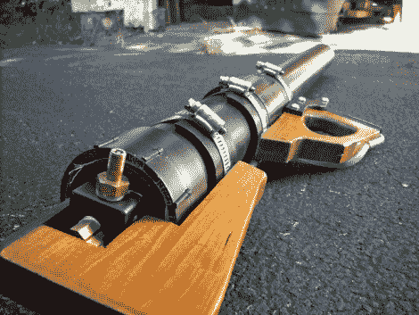

# 水滴发射器

> 原文：<https://hackaday.com/2010/12/03/water-blob-launcher/>

这个[步枪形状的水炮](http://www.wolfsprojectfiles.com/projects/LAWII.php)看起来很棒，出拳很大。我们猜想你可以说这是一个水球发射器，但当发射时，气球会像散弹枪子弹一样脱落。所以我们认为这可以发射水滴，或者圆球，或者类似的东西。

[Wolf]使用聚氯乙烯和一些黄铜配件建造了它，允许注入压缩空气。他开发了一个光滑的阀门系统，我们在建造的照片上看不太清楚。幸运的是，有一个动画 GIF 展示了各个阶段。使用他的阀门，不需要像许多其他[气动发射系统](http://hackaday.com/2010/11/08/build-a-confetti-cannon-for-your-next-party/)使用的任何电气系统。

就像装满水的乒乓球枪一样，你必须小心这个东西。正如你在休息后的视频中看到的，这些抛射物背后有致命的力量。尤其是当[狼]把水球换成大钢镖的时候。

[https://www.youtube.com/embed/nRk6-fdAL4M?version=3&rel=1&showsearch=0&showinfo=1&iv_load_policy=1&fs=1&hl=en-US&autohide=2&wmode=transparent](https://www.youtube.com/embed/nRk6-fdAL4M?version=3&rel=1&showsearch=0&showinfo=1&iv_load_policy=1&fs=1&hl=en-US&autohide=2&wmode=transparent)