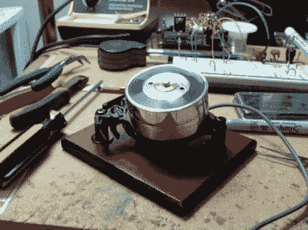

# 经典录像机磁头滚轮

> 原文：<https://hackaday.com/2010/12/04/classical-vcr-head-jog-wheel/>

在这部指令性的中【Osgeld】采用了[经典的 VCR 云台滚轮。他做了一件了不起的工作，不仅在他的构建质量上，而且在文章的质量上。正如他指出的，将头部用作滚轮的想法并不新鲜。然而，他的构造和制造质量已经产生了一个看起来很棒的可靠设备，我们会很自豪地把它放在我们的桌子上。](http://www.instructables.com/id/Spinner-Jog-Wheel-Inside-of-a-VCR-Head/)

像往常一样，文章中最有趣的部分是他如何解决遇到的问题。例如，他用一个光学鼠标来检测轮子的运动。这就要求他打印出一个图案来安装在光学传感器的对面。这听起来很直接，但他发现结果并不理想。他记录了他的修正，基本上是在 GIMP 中重做，这样其他人可以节省一些时间。教程应该是这样的。干得好。