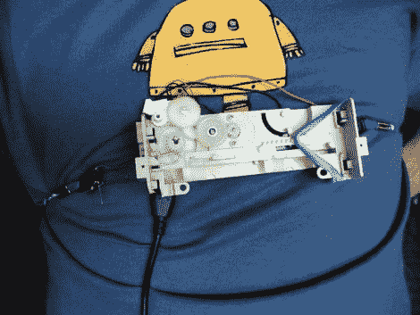

# 呼吸运动供电的 USB 充电器

> 原文：<https://hackaday.com/2010/12/05/breathing-motion-powered-usb-charger/>

当你的电池电量不足时，你可以用你的身体给它们充电。这个装置[在呼吸](http://www.instructables.com/id/Breath-powered-USB-charger/)时通过胸部扩张产生能量。[Jmengel]使用旧光驱中的一些齿轮来提高你躯干周围的腰带产生的转速，他称之为胸部膨胀耦合器。当你吸气时，皮带会拉动一个带动齿轮旋转的板，最终带动一个小马达旋转。该电机产生的交流电流流经整流器和升压转换器，然后馈入充电电路。

有用吗？不尽然，因为这只能输出 50 兆瓦左右。但我们喜欢看到沙丘时的那种怀旧感。这难道不是一件完美的套装吗？