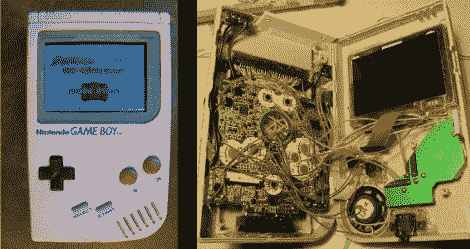

# 原来的外壳房子一个游戏男孩前进 SP

> 原文：<https://hackaday.com/2010/12/06/original-shell-houses-a-game-boy-advance-sp/>

[杰克逊]决定让他原来的游戏机更强大一点，所以他用游戏机升级版替换了内部部件。这使得案件工作减到最少，因为原件比 SP 大。他保留了按钮、扬声器、耳机插孔和电源开关，但修改了外壳，以使用较新硬件的音量、充电器和电池。盒式磁带连接器被重新定位，以匹配后半部分的插槽，彩色屏幕是有人摆弄设备的最大证据。对于一个死去的游戏玩家来说，这是一个不错的用途，至少你会玩这个游戏，而不是[把它奉献给虚拟存储](http://hackaday.com/2009/09/08/update-game-boy-hdd-the-guts/)。