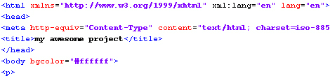

# 项目托管，一个常见的问题

> 原文：<https://hackaday.com/2010/12/07/project-hosting-a-common-question/>

好了，你已经完成了你的项目，一路上做了很好的笔记，拍下了每一步。现在你想分享。你将在哪里张贴它？有很多选择，私人托管、Hackaday、instructables 等等。你怎么能决定？这里有一些方便的分解，帮助你一目了然。

各有利弊。休息之后看看我们的列表，分享你自己的列表。

**1。把它送到 Hackaday.com**T4【什么？Hackaday 将主持我的项目？是的，有可能。我们不会主持一切，但我们真的很喜欢主持酷的东西。就我们而言，这与链接到另一个网站上的项目没有太大的不同。我们仍然写一篇文章，我们仍然给你完全的信任，你只是不需要把它放在其他地方。

优点:大量的读者。免费。缺点:不是一个可以登录和编辑的系统。你发给我们，如果很酷，我们就贴出来。

**2。Instructables.com**
这是一个很常见的选项。它很容易建立，相当受欢迎，推广良好。然而，由于不利因素，我们每天都看到对它的抱怨。

优点:巨大的读者群已经存在。使记录更容易的工具。免费。反对意见:广告有时太强大了。人们必须登录才能查看您的所有照片。

**3。你自己的私人网站。**
绝对控制。

优点:你可以完全控制外观、感觉和行为。缺点:这可能要花一点托管费，而且很耗时。如果你也讨厌网页设计，那就没什么意思了。

**4。一个论坛。**

这是一个很常见的问题。随着项目的发展进行跟踪可能会很好，但是受欢迎的项目可能会有很多页。试图从一个流行的论坛帖子中挖掘出重要的信息是很累的。 ****

优点:你可以完全控制内容。缺点:这不是一个跟踪项目的好布局。人们可能需要登录才能看到它。

**我们的建议:**

你自己的个人网站。当然，建立一个虚拟主机并获得托管服务可能是一件痛苦的事情。不过，最终，您对您的内容拥有最大的控制权。随着 [Fantastico](http://en.wikipedia.org/wiki/Fantastico_%28web_hosting%29) 在主机上变得越来越普遍，你可能甚至不需要学习任何 html。只需支付你的托管费，登录并点击一个按钮，你就可以安装 [wordress](http://wordpress.org/) 或 [joomla](http://www.joomla.org/) 或 [drupal](http://drupal.org/) 。

请告诉我们您还在哪些地方主持您的项目，以及为什么您会选择这些地方。有人想要一个关于建立一个简单的网站来托管你自己的项目的基础教程吗？