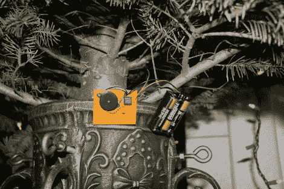

# 圣诞树低水位监控器

> 原文：<https://hackaday.com/2010/12/08/christmas-tree-low-water-monitor/>

年底很快就要到了，很有可能你的客厅里有一棵慢慢死去的树。使用[Eric Ayars'] [圣诞树水监控器](http://hacks.ayars.org/2010/12/christmas-tree-water-level-sensor.html)帮助它坚持一会儿。他用一块长条纸板做了一个传感器。板上的三条总线允许各种报警。当三个都被淹没时，一切都好了。当两个较长的痕迹仍然在水下，但第三个没有，LED 将闪烁，让你知道是时候了。如果你不注意，没有水了，压电蜂鸣器就会发出声音，直到你加水(或者硬币电池没电了)。

这个项目围绕着一个 ATtiny85，它是[Eric]使用 Arduino 编程的，Arduino 是我们在 AVR 编程教程中介绍的方法之一。但是，如果这个简单的电路对你来说不够高科技，我们去年看到了一个类似的方法，它将[向你的 iPhone](http://hackaday.com/2009/12/08/water-the-tree-theres-an-app-for-that/) 发送警报。