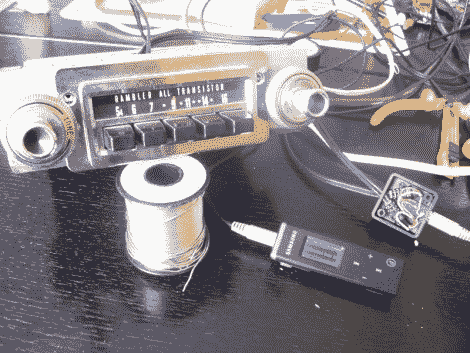

# 老式汽车音响获得 MP3 输入

> 原文：<https://hackaday.com/2010/12/08/vintage-car-audio-gets-mp3-input/>

[李娜]正在修复 1966 年的漫步者大使，并决定给音频有点升级。他没有更换头单元[，而是增加了一个音频输入连接器](http://theamcforum.com/forum/mp3-player-with-old-radio-one-solution_topic16338.html)。他使用的方法简单、便宜，并且允许原来的单元继续作为收音机工作。他切断了连接音量旋钮的馈电线，接上了耳机插孔。他使用的插孔有一个内部开关，当耳机插入时，它可以关闭一对扬声器。每当没有连接器插入时，该插孔将允许来自无线电调谐器的原始信号通过。这似乎在旧硬件上比在现代设备上更容易。

这不是他的娱乐增强停止的地方。[李娜]正在一台 7 英寸的嵌入式 Linux 机器上工作，所以[请留意他的思路](http://www.backyardmetalcasting.com/forums/viewtopic.php?t=5064&postdays=0&postorder=asc&start=0)，看看他能想出什么。

[谢谢 Joel383]