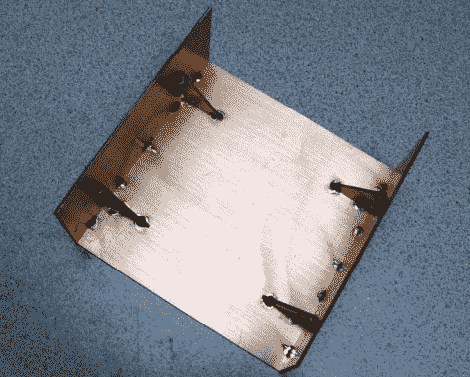

# 覆铜外壳

> 原文：<https://hackaday.com/2010/12/08/copper-clad-enclosures/>

为你的项目建造一个漂亮的盒子是一个挑战。[Ken]将他用覆铜(PDF)电路板材料制作外壳的过程总结成一个图文并茂的指南，以防你想亲自尝试。你为什么想要使用 PC 板？玻璃纤维衬底是一种坚固而轻质的材料。此外，[肯]是一个业余无线电操作员，铜涂层充当内部精密部件的电屏蔽。

正如你在上面看到的，他用焊料把碎片钉在一起。这种方法有一些重要的考虑因素。首先，他把碎片切得稍微大一点，然后在组装前把它们打磨平整。接下来，他用 20 号线作为 90 度接头和直角夹具之间的垫片。这个垫片补偿了焊料冷却时发生的收缩，确保接头被拉成直角。他甚至将螺母焊接到位，以便可以使用螺钉将机箱盖连接到机箱上。

昨天我们看到了用于在 ABS 盒上制作标签的墨粉转印。如果您用覆铜制作外壳，使用碳粉转印面板标签将是轻而易举的事情！