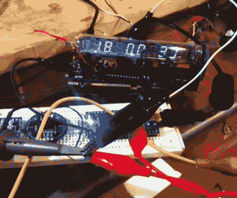

# 冰管钟，来见见计时点

> 原文：<https://hackaday.com/2010/12/09/ice-tube-clock-meet-the-chronodot/>

[亚历克斯]通过在冰管钟上增加一个计时点来提高他的计时器的精确度。这两个项目是我们的最爱；[冰管钟](http://hackaday.com/2009/08/25/learn-from-the-ice-tube-clock/)的老式多位数显示，以及[的 ChronoDot](http://hackaday.com/2009/10/27/parts-chronodot-rtc-module-ds3231/) 将 DS3231、电池和组件组合成一个漂亮的小包装。

在[Alex 的]文章的左下方有一个链接。他提到他从电路板上移除了时钟晶体及其电容对，并接入了 AVR 上的时钟输入。根据 DS3231 数据手册的要求，布线中包含一个 100K 上拉电阻。虽然没有具体提及，但我们假设[Alex]对 ATmega168 时钟选择保险丝进行了重新编程，以使用外部时钟信号。

现在他可以高枕无忧了，因为他知道这个钟每年的精确度在 10 秒以内。