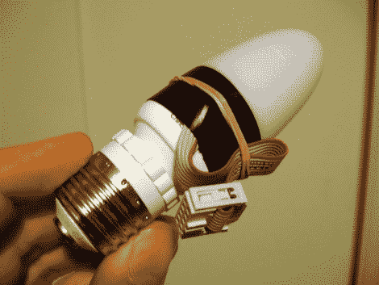
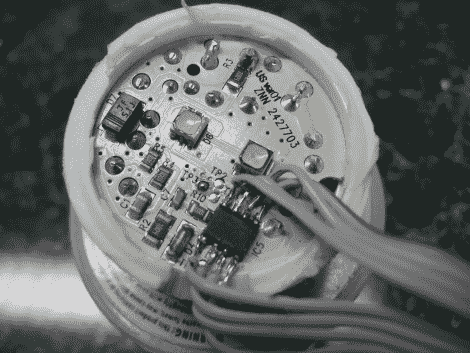
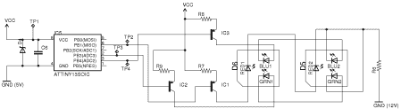
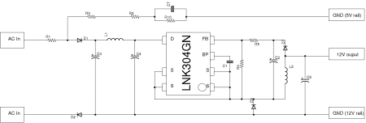

# 第 2 部分:帮我逆向工程一个 LED 灯泡

> 原文：<https://hackaday.com/2010/12/09/part-2-help-me-reverse-engineer-an-led-light-bulb/>

大约一个月前，我开始尝试对一种廉价的 LED 变色灯泡进行逆向工程。在你的帮助下，我设计出了电路，并控制了灯泡。但是在这个小闪光灯里仍然有一些秘密。休息后加入我，看看我到目前为止做了什么，仔细阅读原理图和源代码，并帮助解决剩下的两个谜团。

## **我完成了什么**

首先，感谢所有原帖的评论者。由于这种帮助，我对这条赛道有了更多的了解。值得注意的是，我丢弃的代码没有任何用处，因为锁位已经设置。当我在周二的 [Sector67](http://www.sector67.org/) 会议上分享时，也有很多建设性的意见和猜测。

我很高兴地说，我能够在适当的时候对 ATtiny13 芯片进行编程。我钻穿了一个感应器，弄坏了我砸开的第一个灯泡。第二次我更加小心，将带状电缆焊接到每个微控制器引脚上。

我不用把芯片从电路板上拆下来就能给它编程。这是通过在交流电源未连接时使用高压串行编程(HVSP)来实现的。我将保险丝重置为出厂设置，以启用重置引脚，但我无法使用 ISP 对此进行编程。但这真的不是问题。扩散器贴在适当的位置，我增加了一个 IDC 连接器，方便与灯泡的接口。

我写的固件已经上传到 GitHub 上了。它有几个特点:默认操作是在圣诞节期间作为门廊灯每 20 分钟在红色和绿色之间渐变。我将在下面讨论该电路，但器件上有两个未使用的引脚，我添加了两种测试模式，通过将 IDC 连接器上的引脚跳至地即可进入这两种模式。其中一个测试模式使红/绿推子每 2 秒出现一次。另一个以 1/2 秒的延迟滚动原色和二次色。

因此，我们有一个微控制器来驱动两个串联的 RGB LED 模块。该芯片有两个可用引脚和 1K 的编程空间。所以把它做成 I2C 可寻址模块应该是相对简单的。理想情况下，这将在不使用交流电源的情况下完成，这引发了我在帖子底部提出的一个问题。

## **电路系统**

我找到了电路板，并用欧姆表和连续性测试仪重新制作了原理图。有两个单独的原理图，一个用于 LED 控制电路，另一个用于电源。

正如所料，电源使用 LNK304 数据手册中的示例电路。12V 输出连接到控制器原理图上的两个 VCC 点，但接地或回路有点特殊。请看 PSU 原理图的上半部分，其中包括 R2、R3、R10 和 C7。我将此标记为“GND (5V 轨)”，因为它连接到 ATtiny13 的接地端。“GND (12V 轨道)”连接到 led 的低端，但与微控制器接地路径分离。显然，齐纳二极管箝位了微控制器的电源输入(需要 5V)，但我不知道返回交流电的滤波电路是如何工作的。

看看组件列表，然后看看你是否能帮助解决两个问题。

*   R1-与灯插座的中心导体成直线；约 0.5 欧姆。可能是保险丝
*   R2——1004 年
*   R3–1004
*   R4-3001
*   r5–1302
*   R6——1201 年
*   r7–1Bx
*   R8–270
*   r9 270
*   r10–1003
*   D1–1n 4007
*   D2–1n 4007
*   D3–R106 TF
*   D4——看起来像齐纳二极管
*   D5–RGB LED
*   D6–RGB LED
*   D7–JF S1J
*   IC1–PNP 晶体管
*   IC2–PNP 晶体管
*   IC3–PNP 晶体管
*   IC4–lnk 304 gn 交流/DC 开关转换器
*   ic5 阿蒂尼 13
*   C1–无标签贴片
*   C2-50V 22 uF 电解
*   C3-400 伏 4.7 微法电解
*   C4-400 伏 4.7 微法电解
*   C5–25V 100 uF 电解
*   C6–无标签贴片
*   无标签的 C7- smd
*   L1-102j CEC
*   L2-102j CEC

## **帮忙解答这两个问题:**

1.ATtiny13 的 GND 连接是如何工作的？完整的答案将解释包含 R2、R3、R10 和 C7 的路径的实际功能，以及它如何与开关转换器配合工作。

2.使用 DC 为控制电路供电的最简单方法是什么？

请随意留下你的想法。但是如果你愿意的话，我很乐意阅读更详细的描述，所以把你的想法贴在你自己的主机上，并在评论中留下链接。

## 跟我来

[调匀](http://twitter.com/szczys)调匀