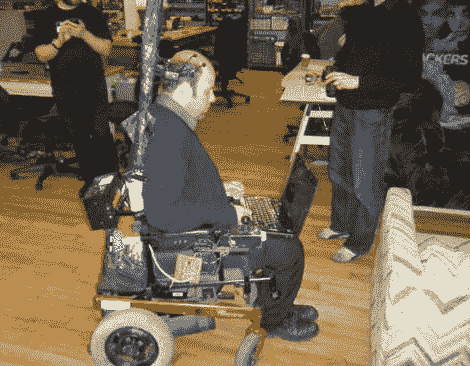

# 运动脑电图

> 原文：<https://hackaday.com/2010/12/10/eeg-the-locomotion/>

使用脑波作为电子系统的控制参数变得相当普遍。与我们在赛博朋克幻想中所渴望的相比，我们能够获得的信号类型仍然非常原始，但它们是朝着正确方向迈出的一步。

获取大脑信号的一个非常诱人的方面是，它可以用来规避身体的限制。[Jerkey]用他的 DIY [脑控电动轮椅](http://www.instructables.com/id/Brain-Controlled-Wheelchair/)展示了这一点，它可以让那些没有能力操作操纵杆的人移动。这种方法是直接的，使用一台笔记本电脑来整理脑电图数据，这些数据被传送到一个 arduino，该 arduino 模拟轮椅控制板的操纵杆操作。从经验中我们知道，很难立即控制脑电图，而且[急跳]在指令开始时的警告，即要有一个手指放在“关”开关上的观测员，应该很好地遵守。也许包括一些[自动防撞](http://hackaday.com/2010/11/10/robotic-mobility-for-the-little-ones/)会很有用。

我们之前已经介绍过[声控轮椅](http://hackaday.com/2008/05/17/voice-controlled-wheel-chair/)，我们想知道这两种类型的控制会如何相互叠加。脑电图比语言更直接，但我们认为它们更难控制。

将[Jerkey]的技术扩展为像[奥伯龙](http://hackaday.com/2010/12/03/next-level-robotic-hijinx/)一样控制 ROV 的一种方式会很有趣，尽管有点琐碎，尽管取决于操作员的能力，语音控制可能很困难(这会使*作为外星机器人外交官更有说服力吗？).*