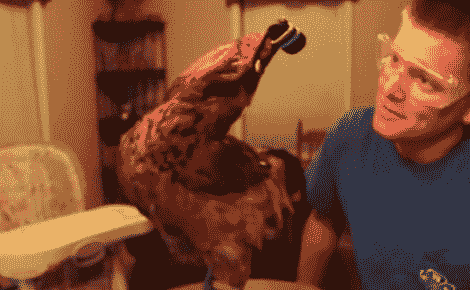

# 用鸡做摄影机稳定器

> 原文：<https://hackaday.com/2010/12/11/using-a-chicken-as-a-steadicam/>

这已经在网上流传了一段时间。对于那些没看过的人，让我给你们简单介绍一下正在发生的事情。这个家伙[在一只鸡的头上绑了一个摄像头](http://www.youtube.com/watch?v=UytSNlHw8J8&feature=player_embedded)。不，真的，就这样。尽管这背后有一些有趣的科学。他在利用鸡的[前庭眼反射](http://en.wikipedia.org/wiki/Vestibulo_ocular_reflex)。这基本上是一种反射，当我们的头在移动时，我们用它来保持我们的眼睛牢牢地聚焦在某个东西上。然而，在鸡身上，它们移动整个头部。这意味着他可以把相机绑在鸡的头上，然后进行即时拍摄。至少理论上是这样。正如你在休息后的视频中看到的，更难的部分是让鸡看你想让它看的东西。我们还在一些 [reddit 评论](http://www.reddit.com/r/WTF/comments/eg410/this_chicken_is_better_than_a_steadicam/c17uj9x)中找到了与创作者【MrPennywhistle】的对话。

[https://www.youtube.com/embed/UytSNlHw8J8?version=3&rel=1&showsearch=0&showinfo=1&iv_load_policy=1&fs=1&hl=en-US&autohide=2&wmode=transparent](https://www.youtube.com/embed/UytSNlHw8J8?version=3&rel=1&showsearch=0&showinfo=1&iv_load_policy=1&fs=1&hl=en-US&autohide=2&wmode=transparent)