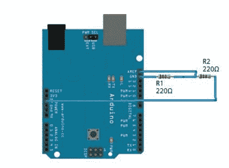

# 通过 Arduino 使用模拟基准电压源

> 原文：<https://hackaday.com/2010/12/11/using-analog-voltage-references-with-arduino/>

小鸟电子发布了一篇关于[使用模拟基准电压源和 Arduino](http://blog.littlebirdelectronics.com/tutorial-arduino-and-the-aref-pin) 的文章。这是使用模数转换器时可用的工具。考虑到 ADC 的分辨率限制，通过设置内部或外部 AREF，您可以更好地使用 ADC。例如，如果您正在测量一个信号，而您知道该信号将始终低于 2V，则分压器或可调调节器等外部电路可以提供一个刚好高于该上限的参考电压；比方说 2.5V。这样，1024 个分辨率将分布在信号范围内，而不仅仅是 ADC 读数的下半部分。

模拟基准电压源对于具有 ADC 的微控制器来说很常见。即使您没有使用 Arduino，也请通读这篇文章，并在您选择的 uC 中使用您所学到的内容。