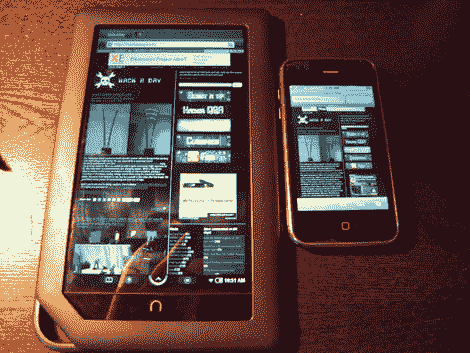

# Nook 色根:动手

> 原文：<https://hackaday.com/2010/12/12/nook-color-rooted-hands-on/>

Nookdevs 发布了关于如何给你的 nook color 定根的信息。所以很自然地，我必须跑出去买一个。谁不想要一台售价 250 美元的多点触控安卓平板电脑呢？生根的说明非常简单。你真的只需要 microSD 卡和一台 Linux/Windows/Mac 电脑就可以连接。生根后，你的 nook 将完全像以前一样工作，但你现在可以在上面安装 android 应用程序。许多应用程序都是为有更多物理按键的手机设计的，所以我遇到了一些问题，但总的来说，这些应用程序运行得很好。

休息之后，请加入我的行列，了解更多想法、一段视频和几张图片。

 <https://www.youtube.com/embed/xyHTgBbBKPo?version=3&rel=1&showsearch=0&showinfo=1&iv_load_policy=1&fs=1&hl=en-US&autohide=2&wmode=transparent>

 
规格相当不错，1024×600 屏幕，8GB 内置存储，带 microSD 扩展槽，wifi，800MHz ARM A8 处理器。正如你在最后一张图中看到的，屏幕上的视角非常棒。电池可能不会持续广告的 8 小时玩游戏，但我还没有给它充电，它已经播放音乐，浏览网页，逗孩子们开心了大约 24 小时。
 
安装软件有点痛苦。你还不能通过设备<em>直接从安卓商店在线安装东西。相反，你必须在网上搜索。apk 文件下载，然后通过命令行安装在您的计算机上。这可能很痛苦，因为。apk 文件很少标明它们是哪个版本的，所以我得到了几个老版本的软件，它们根本不能工作，尽管我在<a href="http://www.youtube.com/watch?v=FEw3bs5Xybw" target="_blank">其他 youtube 视频</a>中见过它们工作。到目前为止，我已经很好地使用了海豚浏览器、谷歌地图、潘多拉和愤怒的小鸟。我不会对 nook 测试应用的涌现感到惊讶。<em>暗示。提示。</em></em>
 
删除应用程序也是一件痛苦的事情。原理很简单，你打开控制台，查看安装了什么文件，然后发出一个简单的命令删除你想要的文件。然而，它们不一定用一个明显的文件名安装。比如我安装了谷歌语音搜索。意识到我没有麦克风，我去把它拿掉。然而，有几个文件标有谷歌，没有一个有语音这个词。我怎么知道是哪一个？快速的谷歌搜索可能会给我找到答案，但是我等不及要把图标拖到垃圾桶里。
 

 

 
总的来说，我迫不及待地想看到这有多好。如果我能从网上找到的 android 商店安装软件，有 flash，并且更容易地删除应用程序，我会非常高兴。
 </body> </html>