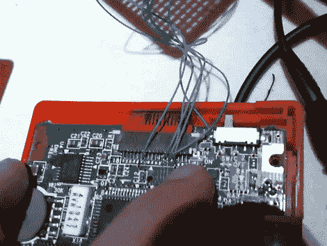

# 使用 FPGA 的游戏机 VGA

> 原文：<https://hackaday.com/2010/12/12/game-boy-vga-using-an-fpga/>

[ViDAR]正在寻找一个项目让他有事可做，并决定为他的游戏机创建一个 VGA 转换器。他很难找到 LCD 和 CPU 的引线，但通过使用已知的示波器，他找到了必要的信号。用那些细蓝线接入几条线路；Vsync、Hsync、clock 和两个数据引脚。从那里开始，带有 Altera Cyclone II 现场可编程门阵列的开发板负责处理繁重的工作。该板已经有了 VGA 连接的硬件，因此只需将输入信号处理成 VGA 标准即可。他的演示视频在分页符后嵌入。

想要专用解决方案？看看这个装在 VHS 录像带里的 Game Boy 视频适配器。

 <https://www.youtube.com/embed/NUIWsUHntf8?version=3&rel=1&showsearch=0&showinfo=1&iv_load_policy=1&fs=1&hl=en-US&autohide=2&wmode=transparent>

 </body> </html>