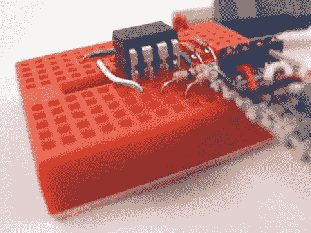

# 打造自己的极简 AVR ISP

> 原文：<https://hackaday.com/2010/12/14/make-your-own-minimalist-avr-isp/>

给一个程序员是一个让人们开始学习微控制器的好方法，所以如果你想要一个便宜简单的 AVR 程序员，这可能就是你要找的。它结合了 [V-USB](http://www.obdev.at/products/vusb/index.html) 固件、 [USBtiny](http://www.xs4all.nl/~dicks/avr/usbtiny/) 软件、几个电阻和一些齐纳二极管。使用这种编程器的一个有趣的技巧是，如果你试图编程另一个 8 针 ATtiny，你可以使用一些磁带来隔离 USB 数据针，然后搭载在编程器上的目标 ATtiny。

不幸的是，为了向你的程序员展示这一点，你需要一个工作的程序员，所以这有点像第 22 条军规。确保在设置熔丝位时小心，因为它将使用 reset 引脚，在没有额外编程硬件的情况下很难对[重新编程。总的来说，AVR 是开始使用微控制器的一个很好的方式，所以如果你感兴趣的话](http://hackaday.com/2010/12/14/avr-hv-rescue-shield-2/)[可以给出教程](http://hackaday.com/2010/10/23/avr-programming-introduction/)。除了关于使用 Arduino 或 DAPA 电缆将固件刷新到该芯片的信息之外，您还可以找到一些入门提示。