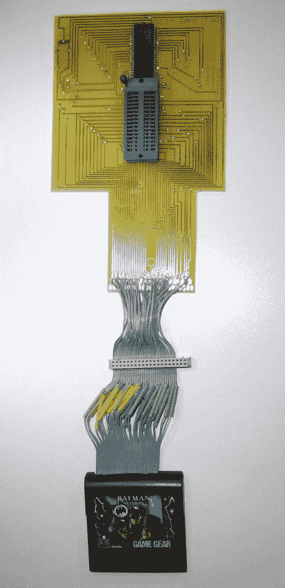

# 开发世嘉游戏装备闪存盒

> 原文：<https://hackaday.com/2010/12/15/developing-a-sega-game-gear-flash-cartridge/>

[Gerry O'Brien]处理了他最近的项目，[为世嘉游戏装备](http://www.digital-circuitry.com/GameGear.htm)设计闪存 ROM 盒，取得了巨大的成功。上面你可以看到他用来逆向工程原始 ROM 芯片和电路板之间的通信的测试设备。他取出芯片，将 ZIF 插座焊接到焊盘上，然后使用 DIP 插座作为芯片的适配器。连接到每个引脚的是逻辑分析仪的测试引线。要破译的频道可真多啊！

原来卡带用的是集成映射(有人有解释这个的链接吗？)所以放入闪存芯片不是一个选项；你需要一个内存条控制器。[Gerry]对这个问题的解决方案是双重的:你可以用控制器芯片和闪存芯片的 ZIF 插座蚀刻你自己的板，或者你可以修改世嘉主系统卡盒以用作适配器板。休息之后，我们有这两种方法的图片，以及他的五个指导视频，带我们走过制作过程。

这不是[Gerry]第一次使用闪存墨盒。今年早些时候，我们看了他和游戏男孩 ROMS 的合作。

这是一块蚀刻过的转接板。IDC 插头用于使用示波器和逻辑分析仪进行测试。

这是一个更加紧凑的适配器，由世嘉主系统模块制成。

查看[【Gerry 的】youtube 频道](http://www.youtube.com/user/NLEproGUY)，在那里你会找到他的教学视频。

 <https://www.youtube.com/embed/YY-Yt31U3Oo?version=3&rel=1&showsearch=0&showinfo=1&iv_load_policy=1&fs=1&hl=en-US&autohide=2&wmode=transparent>

 <iframe class="youtube-player" width="800" height="480" src="https://www.youtube.com/embed/XZZvtaxkz58?version=3&amp;rel=1&amp;showsearch=0&amp;showinfo=1&amp;iv_load_policy=1&amp;fs=1&amp;hl=en-US&amp;autohide=2&amp;wmode=transparent" allowfullscreen="true" style="border:0;" sandbox="allow-scripts allow-same-origin allow-popups allow-presentation"/> <iframe class="youtube-player" width="800" height="480" src="https://www.youtube.com/embed/VHtsm6M8uDE?version=3&amp;rel=1&amp;showsearch=0&amp;showinfo=1&amp;iv_load_policy=1&amp;fs=1&amp;hl=en-US&amp;autohide=2&amp;wmode=transparent" allowfullscreen="true" style="border:0;" sandbox="allow-scripts allow-same-origin allow-popups allow-presentation"/> <iframe class="youtube-player" width="800" height="480" src="https://www.youtube.com/embed/fJ8TXklpKXA?version=3&amp;rel=1&amp;showsearch=0&amp;showinfo=1&amp;iv_load_policy=1&amp;fs=1&amp;hl=en-US&amp;autohide=2&amp;wmode=transparent" allowfullscreen="true" style="border:0;" sandbox="allow-scripts allow-same-origin allow-popups allow-presentation"/> <iframe class="youtube-player" width="800" height="480" src="https://www.youtube.com/embed/X5pI5iraq9A?version=3&amp;rel=1&amp;showsearch=0&amp;showinfo=1&amp;iv_load_policy=1&amp;fs=1&amp;hl=en-US&amp;autohide=2&amp;wmode=transparent" allowfullscreen="true" style="border:0;" sandbox="allow-scripts allow-same-origin allow-popups allow-presentation"/> </body> </html>