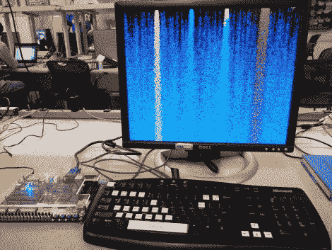

# FPGA 上的落沙游戏

> 原文：<https://hackaday.com/2010/12/15/falling-sand-game-on-and-fpga/>

这个[落沙游戏运行在现场可编程门阵列](http://instruct1.cit.cornell.edu/courses/ece576/FinalProjects/f2010/ss868/ss868/index.html)上。Altera Cyclone II 位于开发板的核心，运行用 Verilog 编写的游戏。[Skyler Schneider]模仿一款名为[的游戏](http://fallingsandgame.com/sand/pyro.html)的 Java 版本设计了他的项目。他将 640×480 VGA 屏幕的每个像素视为自己的单元格，遵循一组规则来更改其周围的单元格。这与[康威的生命游戏](http://hackaday.com/2010/08/18/needs-more-leds-emsl-biggified-conways-game-of-life/)非常相似，除了有不同类别的细胞表现独特(油、水、植物、火等)。)而重力是一个关键因素。我们特别感兴趣的是每个单元的规则，以及[Skyler]用来馈送和同步 VGA 输出的方法。休息之后，你可以看到他的演示视频，其中包括巨魔按钮在内的所有功能。

[https://www.youtube.com/embed/UP2Dgi21O2c?version=3&rel=1&showsearch=0&showinfo=1&iv_load_policy=1&fs=1&hl=en-US&autohide=2&wmode=transparent](https://www.youtube.com/embed/UP2Dgi21O2c?version=3&rel=1&showsearch=0&showinfo=1&iv_load_policy=1&fs=1&hl=en-US&autohide=2&wmode=transparent)

[https://www.youtube.com/embed/sxXG9xpgT5A?version=3&rel=1&showsearch=0&showinfo=1&iv_load_policy=1&fs=1&hl=en-US&autohide=2&wmode=transparent](https://www.youtube.com/embed/sxXG9xpgT5A?version=3&rel=1&showsearch=0&showinfo=1&iv_load_policy=1&fs=1&hl=en-US&autohide=2&wmode=transparent) [https://www.youtube.com/embed/TbLXzA9gz7w?version=3&rel=1&showsearch=0&showinfo=1&iv_load_policy=1&fs=1&hl=en-US&autohide=2&wmode=transparent](https://www.youtube.com/embed/TbLXzA9gz7w?version=3&rel=1&showsearch=0&showinfo=1&iv_load_policy=1&fs=1&hl=en-US&autohide=2&wmode=transparent)

[谢谢安德鲁]