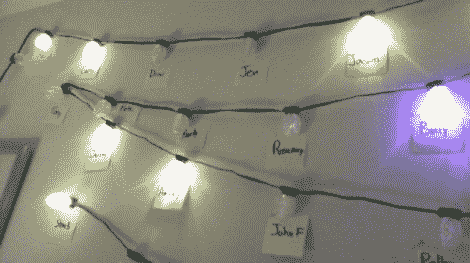

# 聊天列表指示器使用被黑的圣诞灯

> 原文：<https://hackaday.com/2010/12/16/chat-list-indicator-uses-hacked-xmas-lights/>

这里有一种方法可以让[显示哪些好友登录了聊天](http://www.fezzer.com/project/196/ge-35-christmas-lights-individually-addressable/)。这使用相同的 [G-35 被黑的圣诞灯](http://www.tinyclr.com/forum/7/1916/)我们在这个月早些时候看到。[Andrejk 的]公司在团队工作时使用 Microsoft Lync 作为他们的聊天协议。该服务有一个 SDK，允许他写一些。NET 代码来检查状态，并显示在灯串上。它的工作方式和你预期的差不多；红色代表忙，绿色代表有空，紫色代表不在办公室，我们猜测黄色代表不在。休息后观看他演示系统。

<https://player.vimeo.com/video/17699178>

 
[通过<a href="http://downloadsquad.switched.com/2010/12/15/microsoft-nerd-reverse-engineers-christmas-lights-uses-them-as-im-indicators/" target="_blank">下载小队</a>和<a href="http://www.istartedsomething.com/20101214/net-micro-framework-christmas-lights-im-indicators/" target="_blank">开始做某事</a>
 </body> </html>