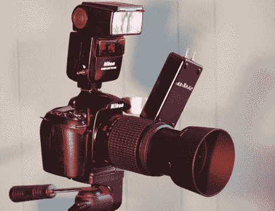

# 如果你在拍照，并且你知道它，就拍拍手

> 原文：<https://hackaday.com/2010/12/18/if-youre-photographing-and-you-know-it-clap-your-hands/>

如果你曾经尝试过给自己拍照，你就会知道这可能是一种痛苦。当你在房间里跑得上气不接下气的时候，要拍下你神圣的面容尤其困难。好的，是的，他们有遥控器。但是如果你丢了遥控器或者你只是不想带着它呢？[LucidScience]整理了一个甜蜜的，嗯，[“免提”替代方案](http://www.lucidscience.com/pro-nikon%20clap%20snap-1.aspx)。

本质上，这个黑客模拟了尼康遥控器发送的红外信号，要么立即拍照，要么定期拍摄延时照片。我们以前见过类似的使用 arduino 的[定时遥控](http://hackaday.com/2009/10/30/time-lapse-courtesy-of-arduino/)和使用 AVR 的[真正彻底的](http://hackaday.com/2009/10/13/a-different-breed-of-camera-controllers/)定时遥控，但是在监控麦克风输入触发方面，他们没有采用与[LucidScience]的设计相同的方法。该项目包括几个状态 led 和对环境噪声和触发的调整，它可以安装在相机机身上。我们想知道尼康有多少功能可以使用 clap 编码来控制，以及您的计时需要多详细才能有一种手工制作的(明白吗？)pulsetrain 语法。你可能需要拥有打破 T4 世界纪录的鼓掌技巧。

休息后请观看演示视频。

 <https://www.youtube.com/embed/U-H0dpP859A?version=3&rel=1&showsearch=0&showinfo=1&iv_load_policy=1&fs=1&hl=en-US&autohide=2&wmode=transparent>

 </body> </html>