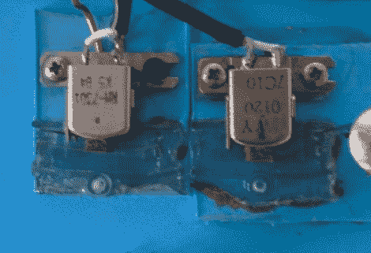
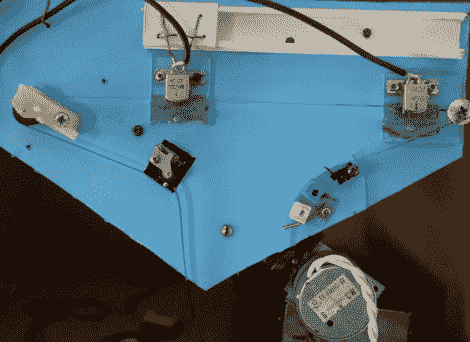
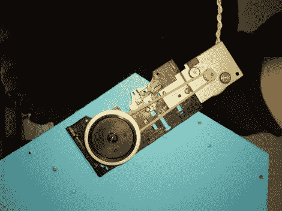

# 用回收盒式磁带制作的磁带延迟

> 原文：<https://hackaday.com/2010/12/20/tape-delay-made-from-recycled-cassette-decks/>

专业的磁带延迟单元非常有趣，但通常很贵。你可能会想，世界上的垃圾箱里塞满了这么多废弃的盒式磁带，一定有人想出了一种制造廉价磁带延迟的方法……这不仅是为了省钱(有时质量是值得花钱的)，也是为了重新利用浪费的资源。

Forosdeelectronica 论坛用户[Dano]已经用用过的卡带盒和各种零件制作了这样一个装置。首先，他研究了播放、擦除和记录机制的操作，并取出了磁带磁头。回放磁头位于塑料轨道上，因此可以改变延迟时间，而录音磁头是固定的。[Dano]在确保记录和擦除的高质量方面遇到了一些困难，这是使用磁带时的一个重要考虑因素。

这个项目的另一个有趣的方面是修改的驱动速度，这将允许一些古怪的时间/音高拉伸。

可以在这里听听工作系统[的音频示例。](http://www.goear.com/listen/21cd1e4/tape-delay-eco)

我们不知道你，但我们有几盒旧磁带放在我们的“待处理”箱里，在其他地方也不难找到——它们中的许多在垃圾日被丢弃在路边。将它与其他音频项目结合起来会很有趣，如[Rich db 的 Kequencer](http://hackaday.com/2010/12/17/rich-decibels-kequencer/)——考虑将延迟长度与序列模式长度相匹配！更挑剔的是，你可以使用一些[定制齿轮](http://hackaday.com/2010/06/30/how-to-design-your-gears/)来摆弄驱动机制——想想多重循环和反转。

为了便于说明，本文中的图片取自[Forosdeelectronica.com](http://www.forosdeelectronica.com/)。如果你想在[Dano]的帖子中看到他们，你必须在他们的论坛上注册。