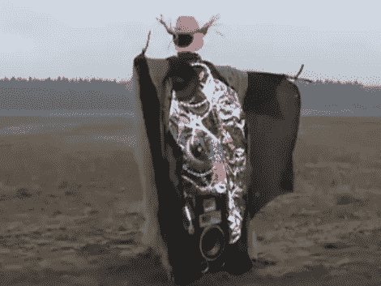

# 德国工程制造出一个过于复杂的稻草人

> 原文：<https://hackaday.com/2010/12/21/german-engineering-produces-an-overcomplicated-scarecrow/>

这个[电子稻草人](http://www.youtube.com/watch?v=pLXn--oxvAk)让鸟儿远离，同时让你的邻居讨厌你。那是因为它太吵了，即使隔壁的房子离得很远。给我们带来[攀岩自行车存储](http://hackaday.com/2010/11/29/climbing-bike-storage-thwarts-thieves/)设备的康拉德·德公司的人又开始了，把汽车音响和灯串组合在一起，作为驱鸟技术的一部分。在休息后的视频中，你会看到他们使用 PIR 运动传感器来切换汽车放大器和音响单元的电源。扬声器、灯串和旋转的玩具都藏在黑色斗篷下。当一只毫无防备的鸟试图享用庄稼时，稻草人会像吸血鬼一样张开手臂，引起一阵骚动。我们不希望在当地的农场看到这个，但是也许在明年的万圣节？

[https://www.youtube.com/embed/pLXn--oxvAk?version=3&rel=1&showsearch=0&showinfo=1&iv_load_policy=1&fs=1&hl=en-US&autohide=2&wmode=transparent](https://www.youtube.com/embed/pLXn--oxvAk?version=3&rel=1&showsearch=0&showinfo=1&iv_load_policy=1&fs=1&hl=en-US&autohide=2&wmode=transparent)

[via [Neatorama](http://www.neatorama.com/2010/12/01/modern-scarecrow/)