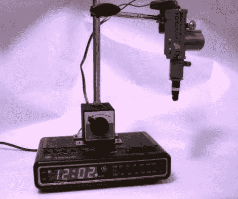

# 这个黑客真的让我们很恼火

> 原文：<https://hackaday.com/2010/12/21/this-hack-really-pushes-our-buttons/>

是的，如果你有一个按钮需要按下，[这是一种方法](http://www.instructables.com/id/The-Automatic-Button-Pusher/)。[Travis]将一个旧闹钟与一个汽车门锁致动器和最少的逻辑电路结合起来，实现了这一点。当闹铃时间到了，可调节的致动器下降，按下放在它下面的按钮。在休息后的视频中，他用它来安排他的 Roomba 的开始时间，制作他的咖啡，加热他的披萨，或者毫无意义地按下时钟自己的贪睡按钮(经典)。我们认为这只是乞求与鲁布-戈德堡设置一起使用，也许是为了推翻其他机器人花时间设置的[奥米诺。哦，等等…那也出现在视频里了。太棒了。](http://hackaday.com/2010/01/11/lego-robot-lays-dominoes-not-eggs/)

[https://www.youtube.com/embed/emaWr7aDaEE?version=3&rel=1&showsearch=0&showinfo=1&iv_load_policy=1&fs=1&hl=en-US&autohide=2&wmode=transparent](https://www.youtube.com/embed/emaWr7aDaEE?version=3&rel=1&showsearch=0&showinfo=1&iv_load_policy=1&fs=1&hl=en-US&autohide=2&wmode=transparent)