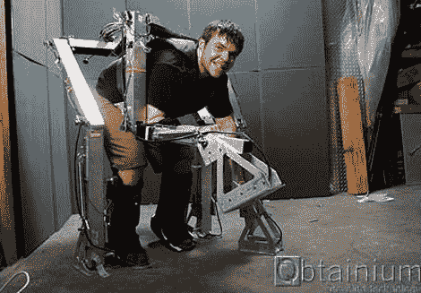

# 如何在圣诞节成为一只恐龙

> 原文：<https://hackaday.com/2010/12/21/how-to-be-a-dinosaur-for-christmas/>

嗯，[这套金属套装](http://cgi.ebay.com/Pleo-ProtoType-Development-Suit-Mech-MOCAP-UGOBE-Rare-/130322699245)可能不会让你变成恐龙，但你完全有可能在电脑上玩一把。这款设备在易贝的零售价仅为 2,397.99 OBO 美元(加上 350 磅箱子的运费)，它是为乌戈贝的 [Pleo 机器人](http://hackaday.com/2010/01/08/ces-pleo-shows-its-guts/)的动作捕捉而制造的。有了正确的外部组件(不知道那些是什么)，完全有可能让这套衣服恢复动作捕捉，因为所有的机载电子设备都包括在内。这种设置对于任何计划制作需要一些参考动作的动画恐龙电影的人来说都是完美的，或者对于任何需要 40 层楼高的死亡机器人恐龙的控制装置的疯狂的~~科学家~~工程师来说都是完美的。可能性是无限的！

[易贝 via [Engadget](http://www.engadget.com/2010/12/20/prototype-pleo-motion-capture-exoskeleton-up-for-grabs-2-400-o/)