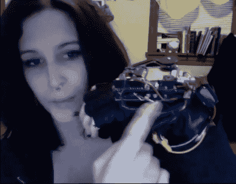

# 为你的击掌增添爆发力

> 原文：<https://hackaday.com/2010/12/22/add-explosive-power-to-your-hi-five/>

已经有一段时间没有在这个领域取得任何进展了。[Eli Skipp]刚刚完成了她的贡献，通过为她的击掌添加爆炸的声音，将艺术向前推进了一步。休息之后，请忽略视频中的音频同步问题，看看她基于 Arduino 和 Wave Shield 的产品。它使用一个柔性传感器来检测击掌，并有一点软件过滤，以避免在移动你的手或将其放在平坦的表面上时发生误射。由于体积庞大，现在看起来可能有点可笑，但我们可以看到一个更时尚、更便宜的版本在各地的玩具和新奇商店上市。

不如手语翻译手套有用，但更容易编码，有些人会说更有趣。

 <https://www.youtube.com/embed/UWu-PcpwFcE?version=3&rel=1&showsearch=0&showinfo=1&iv_load_policy=1&fs=1&hl=en-US&autohide=2&wmode=transparent>

 </body> </html>