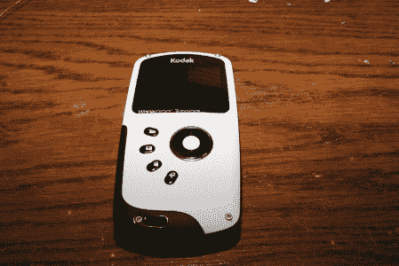

# 柯达 ZX3 拆卸和俄罗斯方块

> 原文：<https://hackaday.com/2010/12/24/kodak-zx3-teardown-and-tetris/>

[Sprite_TM]主持的一个论坛给了他一台[柯达 ZX3 供他玩。柯达 ZX3 是一款防水高清便携式摄像机，采用手机/ mp3 播放器外形。打开摄像机后，他用瞄准镜四处查看，找到了电路板上的一个串口。很快就很明显，该系统使用了一个名为 PrKernelV4 的专有内核，而不是一个开源的替代品。他没有让专有内核拖垮他，而是通过简单地修改 sd 卡上一个名为“autoexec.ash”的文件来利用这个系统。他现在有了一个俄罗斯方块的克隆版，可以很容易地从一个以前没有用过的菜单图标上启动。休息之后看看它的实际效果。](http://spritesmods.com/?art=zx3hack)