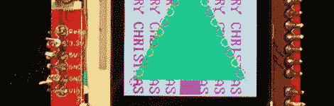
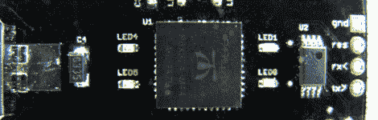

# 黑客日链接:2010 年 12 月 26 日

> 原文：<https://hackaday.com/2010/12/26/hackaday-links-december-26-2010/>

**义务科技树**

****

如果不去看一个令人讨厌的圣诞树项目，很难度过一个圣诞节。幸运的是，[彼得·达文波特]决定分享他的 [Arduino 和 LCD 盾树](http://peterdavenport.blogspot.com/2010/12/its-8-bit-christmas-charlie-brown.html)。

**闪烁的 USB 老兄**

****

如果你有一个 555 定时器和一些常见的可回收部件，试试这个闪烁的 LED 灯。上面的版本是 USB 供电的，但那只是为了利用 5V 的稳压电源。

**螺旋桨名片**

****

[Jay's] [名片](http://www.chasingtrons.com/main/tag/business-card)用这个螺旋桨微控制器包装相当有冲击力。我们喜欢看到卡中的电子设计(无论价格和便携性多么不切实际)，与[基于 Tiny85 的产品](http://hackaday.com/2010/10/29/tiny-usb-business-card/)相比，这是一个巨大的处理升级。

**在纽约高飞**

**
**

我们留给你纽约市的壮观景象。这个令人惊叹的镜头就像我们从这些人那里看到的第一个视频一样令人着迷。