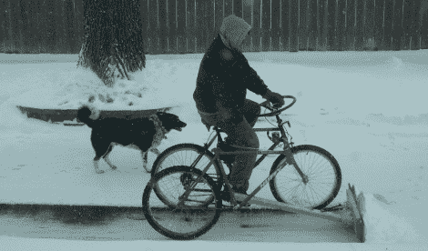

# 为犁地而造的三轮车

> 原文：<https://hackaday.com/2010/12/29/a-tricycle-built-for-plowing/>

当你把两辆自行车、几根杠杆和一把自制的木铲组合在一起时，你会得到什么？当然是轻型三轮车犁啦！萤火虫工作室的[克雷格]拼凑了这个装置来帮助他在 90 英尺高的车道上铲掉几英寸厚的雪。比普通的铲子更方便，比他的 8 马力吹雪机更环保，这辆三轮车看起来可以让铲雪变得有趣。这里没有什么比看上去的更多，我们只是希望我们有一个视频来分享这个甜蜜的旅程。