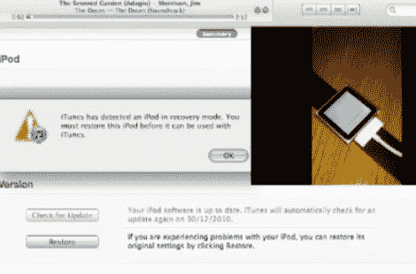

# IPod Nano 6g 即将被破解

> 原文：<https://hackaday.com/2010/12/29/ipod-nano-6g-closer-to-being-crack/>

[Steven Troughton-Smith]想出了如何将签名的固件推送到 iPod Nano 6g 上。这是通过修改 [iRecovery](http://theiphonewiki.com/wiki/index.php?title=IRecovery) 在强制恢复模式重启后识别 USB 上的设备来实现的。所以不，这并不意味着它已经被破解了，因为它会检查你推送的固件，如果没有通过就会重启。但是如果你能想出如何制作一个通过检查的自定义图像，你就可以称自己为越狱作者。

 <https://www.youtube.com/embed/u_c8VM7lVo4?version=3&rel=1&showsearch=0&showinfo=1&iv_load_policy=1&fs=1&hl=en-US&autohide=2&wmode=transparent>

 
[感谢 RavK via <a href="http://nanohack.me/?p=45" target="_blank"> NanoHack </a>
 </body> </html>