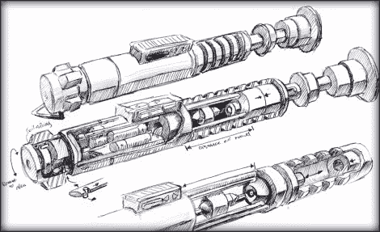

# 光剑拥有可拆卸的剑刃和水晶室

> 原文：<https://hackaday.com/2010/12/30/lightsaber-boasts-detachable-blade-and-crystal-chamber/>

[布拉德利·w·刘易斯]继续用[绝地光剑的回归](http://www.slothfurnace.com/sabers/ROTJLuke_01.html)给我们带来惊喜。你会记得他在《T2》第四集的复制品《T3》中的出色表现。他选择了对他有利的部分，并加以扩展。在休息后的演示中，你会看到新版本有一个可移动的刀片(恰好容纳 90 个 led)。就像上次他用孩之宝音板和扬声器添加绝地武士般的音效一样。但是他还有一个锦囊妙计。手柄的两个部分在弹簧组件上滑动分开，露出赋予武器刺痛的水晶。正如我们上次发现的，[Bradley]真的知道如何在构建日志中分享他的工作。

哦，那上面的画呢？精心策划的人显然知道他们在做什么。

[https://www.youtube.com/embed/z3xxuGeLZcg?version=3&rel=1&showsearch=0&showinfo=1&iv_load_policy=1&fs=1&hl=en-US&autohide=2&wmode=transparent](https://www.youtube.com/embed/z3xxuGeLZcg?version=3&rel=1&showsearch=0&showinfo=1&iv_load_policy=1&fs=1&hl=en-US&autohide=2&wmode=transparent)