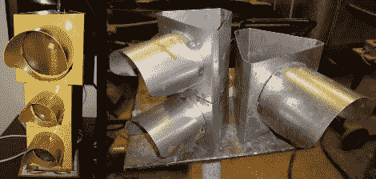

# 制作音乐控制的交通信号灯

> 原文：<https://hackaday.com/2010/12/31/fabricating-a-music-controlled-stoplight/>

[安德鲁]为自己建造了一个随着音乐闪烁的交通信号灯。不像我们一年前检查过的[交通信号](http://hackaday.com/2010/01/05/arduino-traffic-light/)，这不是一个重复使用的市政设施。[Andrew]将一个 3D 模型导入 Sketchup，打印出结果，并在[布里斯托尔板](http://en.wikipedia.org/wiki/Bristol_board)上描绘出来，制作他的模板。他切下零件，用刹车弯曲，然后结合点焊和 MIG 焊来完成外壳。去他学校的喷漆房涂底漆、烘烤和油漆，以达到完美的效果。

内部是你所期望的。每个光源都是由一组由 Arduino 控制的 led 组成的。音乐同步是由[Andrew]编写的一个处理脚本处理的，您可以在休息之后看到它的运行。

[https://www.youtube.com/embed/jtpZ0L81oBo?version=3&rel=1&showsearch=0&showinfo=1&iv_load_policy=1&fs=1&hl=en-US&autohide=2&wmode=transparent](https://www.youtube.com/embed/jtpZ0L81oBo?version=3&rel=1&showsearch=0&showinfo=1&iv_load_policy=1&fs=1&hl=en-US&autohide=2&wmode=transparent)