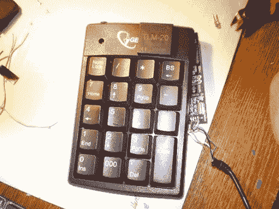

# 构建安全访问面板

> 原文：<https://hackaday.com/2010/12/31/building-a-security-access-panel/>

事实证明，如果你知道自己在做什么，组装一个安全键盘非常简单。[Don]需要添加一个带有 RFID 阅读器的键盘。他[以前建造了一个 USB RFID 阅读器](http://hackaday.com/2009/07/30/lazy-mans-usb-rfid-reader/)，并认为他可以将这些概念整合到新的单元中。

他再次从串行转 USB 转换器开始，并移除了电压转换器 IC 以备后用，因为这个项目不需要 TTL 电平。键盘是一个 USB 产品，原来里面有一个集线器。由于内部有足够的空间放置串行转换器 PCB，并且在顶部有一个空白处安装了 RFID 阅读器，他添加了一些无源组件来连接它并将其连接到集线器。唯一的连接是原来的 USB 线，但电脑将检测键盘和转换器。