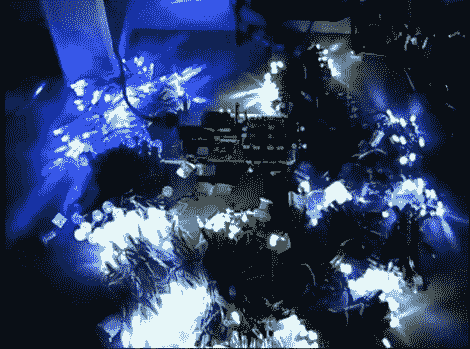

# 圣诞灯控制器

> 原文：<https://hackaday.com/2010/12/31/christmas-light-controller/>

我们得到了很多关于圣诞灯光控制器的提示，但很少包含[文斯·卡佩拉诺]在他的设置中包含的那种有趣的细节。[他解释他制作的控制器](http://www.youtube.com/watch?v=WP0twADv4S0)的视频在休息后嵌入，不容错过。

我们认为这个项目包含了很多好的设计。首先，他有八个物理通道，每个都有 optisolation 和一个 triac，用于 256 级功率控制。但是如果你使用 LED 照明，他可以将控制翻倍到 16 个虚拟频道。这是因为在这些串上，一半的 led 相对于其余的是反向偏置的。通过在输入的交流电中添加感应电路，他可以切换三端双向可控硅开关，只通过 LED 线发送正电压或负电压，从而产生额外的虚拟通道。我们提到过他使用绕线和点对点焊接来完成所有这些吗？

[https://www.youtube.com/embed/WP0twADv4S0?version=3&rel=1&showsearch=0&showinfo=1&iv_load_policy=1&fs=1&hl=en-US&autohide=2&wmode=transparent](https://www.youtube.com/embed/WP0twADv4S0?version=3&rel=1&showsearch=0&showinfo=1&iv_load_policy=1&fs=1&hl=en-US&autohide=2&wmode=transparent)