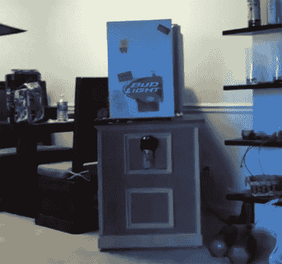

# 啤酒射击宿舍冰箱

> 原文：<https://hackaday.com/2011/01/01/beer-shooting-dorm-fridge/>

当我们第一次听到这个项目的零件清单时，我们并没有太大的印象。它有一个连接到 IObridge 等的 iPhone 但我们听到了下一个，也是最重要的部分，一个 **[空气炮和各种啤酒](http://gizmodo.com/5719649/perhaps-the-best-beer-bot-to-ever-grace-a-dorm-room)** 。我们被卖了。正如你在休息后的视频中看到的，一个别致的 iPhone 界面让你选择你的啤酒，然后将它分配到大炮中进行交付。下一步是使用安装在加农炮上的网络摄像头瞄准，然后开始射击！啤酒穿过房间，送到你的手里。我们怀疑，随着夜晚的继续，颅脑损伤、干墙上的洞和碎玻璃的数量会大大增加。太棒了。

 <https://www.youtube.com/embed/TVyLuosZ1rY?version=3&rel=1&showsearch=0&showinfo=1&iv_load_policy=1&fs=1&hl=en-US&autohide=2&wmode=transparent>

 </body> </html>