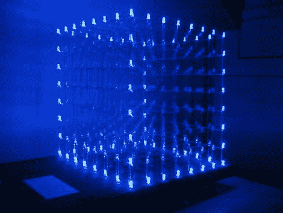

# 512 LED 立方体

> 原文：<https://hackaday.com/2011/01/02/512-led-cube/>

拿出烙铁并清空你的时间表，组装这个总共包含 512 个 LED 的 [8x8x8 LED 矩阵](http://www.instructables.com/id/Led-Cube-8x8x8)需要一段时间。我们已经看过[的一个 3x3x3 的立方体](http://hackaday.com/2008/06/20/3x3x3-led-cube/)，负责这个的【Chr】以前也组装过一个 4x4x4 的立方体，但是这个在复杂性上有很大的飞跃。随着规模的扩大，不仅仅是物理装配问题，你还需要考虑电源，因为一层 3x3x3 立方体需要 90 mA，但上面的一层立方体需要 640 mA 来点亮所有的二极管。多路复用是逐层处理的，由共享 8 条数据线并由移位寄存器锁存的 IC 控制。这意味着显示器只需要 11 个微控制器引脚进行寻址。令人惊讶的是[Chr]对设计过程的解释如此之好，他在 protoboard 上构建驱动电路的方式如此干净利落。有很多东西要看，有很多东西要学，更不用说休息后在视频中可以看到的惊人结果了。

 <https://www.youtube.com/embed/6mXM-oGggrM?version=3&rel=1&showsearch=0&showinfo=1&iv_load_policy=1&fs=1&hl=en-US&autohide=2&wmode=transparent>

 
[谢谢瓦迪姆]
 </body> </html>