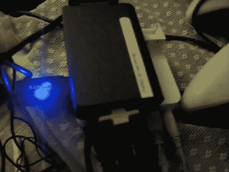

# Dockstar 上的经典游戏仿真

> 原文：<https://hackaday.com/2011/01/02/classic-game-emulation-on-the-dockstar/>

[亨特·戴维斯]在希捷码头之星上运行《魂斗罗》、《猴岛》和《雷神之锤 3》等游戏。休息过后，我们在视频中看到了它们的出色表现，这让我们感到震惊。过去[使用 ZipIt 进行游戏仿真](http://hackaday.com/2009/09/03/nes-on-zipit/)的【亨特】，增加了几个硬件外设来让一切运行。对于声音，他拿起一个便宜的 USB 声卡，这是没有问题的启动和运行。接下来，他拿起一个 USB 转 DVI 适配器，启动了 Linux USB DisplayLink 驱动程序[。随着外围设备的运行，他加载了 Fluxbox，剩下的就是历史了。对于一个小型网络存储适配器来说并不坏。](http://libdlo.freedesktop.org/wiki/)

 <https://www.youtube.com/embed/hwVwFHDA5iE?version=3&rel=1&showsearch=0&showinfo=1&iv_load_policy=1&fs=1&hl=en-US&autohide=2&wmode=transparent>

 
[谢谢克里斯]
 </body> </html>