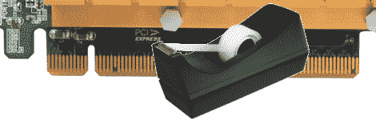
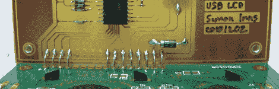

# 黑客日链接:2011 年 1 月 2 日

> 原文：<https://hackaday.com/2011/01/02/hackaday-links-january-2-2011/>

**DIY 驾驶控制器**

****

看起来这个方向盘、换挡杆和脚踏板都是用绳子和垃圾做成的。也就是说，[你可以看到它工作得很好](http://www.youtube.com/watch?v=vunngNAnF8Y)。设置只是按下键盘上的按键，这让我们想起了 Wii 遥控器的垃圾塑料附件。[感谢 Toumal]

**录制 PCI express**

****

[pseudo lobster]的公司正在为一家零售商组装销售点机器。他们有多余的计算机，这确实降低了价格，但在添加第二台显示器时遇到了障碍。这些盒子不适合 PCIe 16x。他的解决方案是用透明胶带将 19-82 号大头针粘在卡片上，有效地将它们变成了 PCIe 1x…而且成功了！这里没有链接，但我们还是想分享这个技巧。

**USB 字符显示**

****

[Simon Inns]展示了如何[在电脑机箱](http://www.waitingforfriday.com/index.php/PC_Case_USB_LCD)中添加字符显示。在之前，我们已经看过他用这些 PIC 18F2550 控制器[工作过几次，但是我们喜欢它很好地搭载了绿色显示板。](http://hackaday.com/2010/08/05/rgb-vu-meter/)