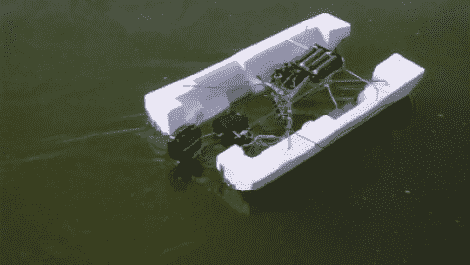

# 遥控玩具汽车浮桥

> 原文：<https://hackaday.com/2011/01/03/rc-pontoon-from-a-toy-car/>

凯文·桑多姆用一辆无线电控制的玩具车建造了这艘船。这两个浮桥是从聚苯乙烯泡沫塑料包装材料中回收的，使用一些粗电线将它们连接起来，并为推进和控制电路提供一个框架。发动机本身是一个舷外爱好，这真的只需要[凯文]开发一种方法来驾驶。休息后，他在视频中向我们展示了构建过程，我们发现原来的玩具有一个非常糟糕的设计缺陷。似乎这辆车使用了四节 AA 电池来驱动马达，但四节电池中的一节也与另外三节分开使用，为控制电路供电。电池比其他电池消耗得更快会缩短整个电池的寿命。

这比我们之前见过的[水下 ROV hacks](http://hackaday.com/2010/05/05/remote-operated-underwater-vehicle/) 要容易得多。我们确实认为这将是一个有趣的周末项目，而且我们打赌你会因为在池塘周围驾驶看起来像垃圾的东西而得到一些奇怪的表情。

 <https://www.youtube.com/embed/hmQ8cSK8f0c?version=3&rel=1&showsearch=0&showinfo=1&iv_load_policy=1&fs=1&hl=en-US&autohide=2&wmode=transparent>

 
[谢谢罗伯]
 </body> </html>