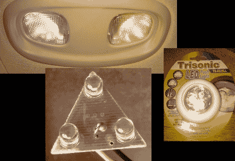

# 顶灯 LED 改装

> 原文：<https://hackaday.com/2011/01/04/dome-light-led-retrofit/>

皮特汽车顶灯的一个灯泡烧坏了。这些东西很难找到替代品，所以[他认为他应该尝试一些更耐用的东西](http://petemills.blogspot.com/2011/01/3-led-map-light-replacement.html)，并且经得起汽车电子设备的振动。但是更换插入式 LED 灯的费用比他愿意花的要多。幸运的是，汽车零件商店隔壁有一家一元店，所以他买了三个 LED 触摸灯，分别用于顶灯和货物灯泡。

打开后，他发现发光二极管是并联的。他需要将这些串联起来，以便利用电压降。将灯泡脱焊后，他测量了一个灯泡的特性，然后计算了电压降和电阻值，使用了 14V 的最坏情况，以避免在发动机高速运转时损坏灯泡。从那里，他切断电路板上的线路，并重新布线。返工模块非常适合，正如你在图像中看到的，比普通灯泡的橙色更令人愉快。