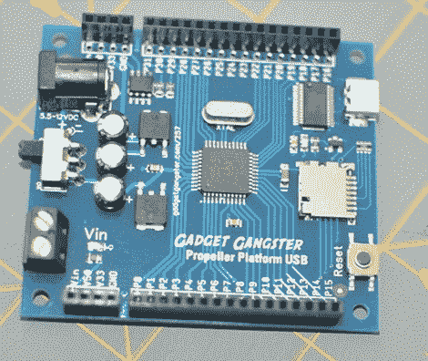

# 视差推进器入门

> 原文：<https://hackaday.com/2011/01/04/getting-started-with-the-parallax-propeller/>

[gadget gangster]的人一直在开发一套优秀的教程，帮助[开始学习 Propeller](http://www.gadgetgangster.com/tutorials/293) 芯片本身、开源 Propeller 平台模块和用于控制事物的 Spin 编程语言。所有的基础知识和越来越多的高级主题都有详细的介绍，大多数教程都包含有用的照片和屏幕截图、源代码列表和视频演示，以帮助您理解作者在谈论什么。

视差对于微控制器游戏来说并不新鲜。大约二十年前，他们基本的嵌入式微控制器是许多修补者的跳板。Parallax Propeller 是一款易于使用的微控制器，已经流行了一段时间。几个螺旋桨支持模块最近已经上市，为螺旋桨提供电源和接口功能，类似于流行的 Arduino 平台与 AVR 微控制器的接口。