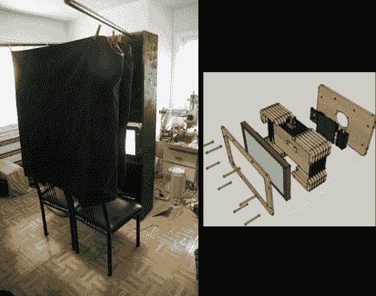

# 折叠式照相亭

> 原文：<https://hackaday.com/2011/01/04/foldaway-photo-booth/>

为了他的婚礼，[戴夫]想有一个照相亭，但 1000 美元的租赁价格真的让他失望。相反，他决定建造自己的。这花费更少的钱，一旦庆祝活动结束，他就可以保留这个摊位。他开始在 Sketchup 中设计程序集，考虑到允许它通过门口的可移植性要求。他想出的是一个由一张胶合板制成的单元，可以通过钢琴铰链折叠，安装需要大约 8 分钟(休息后的视频)。但设计真正出彩的地方是右边模型中的一体化电子模块。它将显示器和计算机封装在一个紧凑而坚固的包装中。

如果你喜欢这里，你还应该去看看[手提箱照相亭](http://hackaday.com/2010/10/04/photo-booth-in-briefcase-form/)和另一个[婚礼宣传建筑](http://hackaday.com/2010/09/28/photo-booth-for-a-wedding/)。

[https://www.youtube.com/embed/jNGg821bC7c?version=3&rel=1&showsearch=0&showinfo=1&iv_load_policy=1&fs=1&hl=en-US&autohide=2&wmode=transparent](https://www.youtube.com/embed/jNGg821bC7c?version=3&rel=1&showsearch=0&showinfo=1&iv_load_policy=1&fs=1&hl=en-US&autohide=2&wmode=transparent)