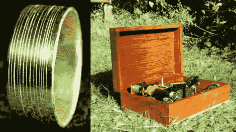

# 让结婚戒指和她说话

> 原文：<https://hackaday.com/2011/01/05/make-the-wedding-ring-speak-to-her/>

在结婚戒指上刻上衷心的信息是一种很好的触摸，我的夫妇选择这样做。但是你可以用 20 秒的音频信息说更多。这正是[卢克·杰拉姆]所做的，他在这个戒指上蚀刻了一个音轨。他使用他定制的硬件来回放信息，你可以在休息后的视频中看到。圆环是一个爱迪生圆筒，它的工作原理就像一个现代的唱机，只是媒体是在一个旋转的鼓(圆环)上，而不是在一个旋转的磁盘上。我们想知道这是否会听起来更好一点与[一个高端缸球员](http://hackaday.com/2009/09/24/edison-cylinder-recordings-need-more-cowbell/)。

当你在[卢克]的页面上时，你也不妨看看他的[图像投影环](http://www.lukejerram.com/projects/portrait_projecting_ring)。它的一面是彩色图像幻灯片，另一面是投影镜头。古怪！

[https://www.youtube.com/embed/eWdAE09VVZw?version=3&rel=1&showsearch=0&showinfo=1&iv_load_policy=1&fs=1&hl=en-US&autohide=2&wmode=transparent](https://www.youtube.com/embed/eWdAE09VVZw?version=3&rel=1&showsearch=0&showinfo=1&iv_load_policy=1&fs=1&hl=en-US&autohide=2&wmode=transparent)