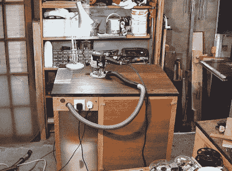

# 清除材料的静音除尘器

> 原文：<https://hackaday.com/2011/01/05/quiet-dust-extractor-from-scavenged-materials/>

正如 hackaday 上报道的许多项目一样，[bongodrummer]的[粉尘狙击手](http://www.instructables.com/id/Dust-Sniper-quiet-extractor-system/)的出现是因为缺乏有效的商业解决方案，在这种情况下，是为了解决安静除尘的问题。

车间通常充满灰尘和噪音，这两者都对人体有害。这就是为什么存在针对嘈杂和多尘工作场所的安全规定，而且正如(bongodrummer)正确指出的那样，我们必须在自己的家庭和社区车间采取预防措施。听力保护器、防尘口罩和安全护目镜是不可或缺的，但首先减少灰尘和噪音是最重要的。

使用大部分拾荒者的材料[bongodrummer]做了一个高质量的工作，建造了尘埃狙击手——所有的材料清单总共 20 英镑。它有一个集成的工作表面，2 个真空管路上的自动开关，以与电动工具同步，一个气旋式空气过滤器，防止堵塞 HEPA 过滤器并降低吸力，入口和出口隔音，以及一个普通的旧电源插座。

无论你是否有兴趣建立一个像这样的集成工作台/提取器系统，我们建议你检查旋风过滤器和声音减少组件的细节。它们不仅是有趣的读物，而且对应用于其他项目也是有用的，例如带通风橱的[焊接站](http://hackaday.com/2008/08/05/how-to-the-hackers-soldering-station/)。

我们认为在我们的项目中加入更多的飓风会非常好。休息后留下来看看[bongodrummer]的原型气旋过滤器的运行。

 <https://www.youtube.com/embed/o850ATauMDM?version=3&rel=1&showsearch=0&showinfo=1&iv_load_policy=1&fs=1&hl=en-US&autohide=2&wmode=transparent>

 </body> </html>