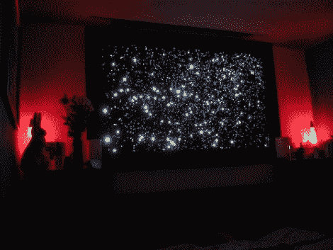

# 用一棵老圣诞树创作艺术品

> 原文：<https://hackaday.com/2011/01/07/creating-art-from-an-old-christmas-tree/>

所以你设法在圣诞节后的销售中买到了一棵很好的假圣诞树，但是你该怎么处理你的旧圣诞树呢？如果它是用光纤照亮的，你可以重复使用这些线[来创建你自己的星图](http://www.instructables.com/id/Star-Map)。[特里克先生]展示了如何拆开这些树中的一棵，将纤维按长度分组。他做了一个木头框架，然后用一层纸板和另一层黑色织物覆盖。从那里开始，以一种看起来令人信服的方式铺设纤维的艰苦过程开始了。[特里克先生的]最终产品使用多个 LED 光源，甚至包括射频控制。

觉得这个项目很大很耗时？看看卧室天花板上的同一个创意。