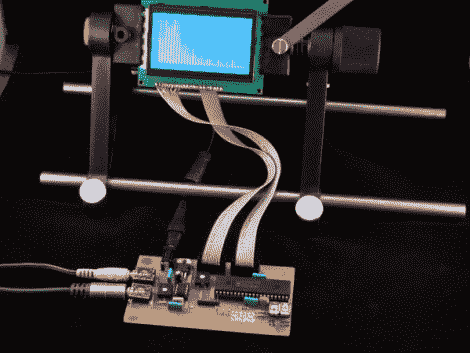

# PIC 频谱分析仪使用快速傅立叶变换程序

> 原文：<https://hackaday.com/2011/01/08/pic-spectrum-analyzer-uses-fast-fourier-transform-routine/>

[Simon Inns]刚刚推出了他的最新项目，[一个基于 PIC 的频谱分析仪](http://www.waitingforfriday.com/index.php/Real-Time_Audio_Spectrum_Analyser)。他使用 C 语言编写的[快速傅立叶变换](http://en.wikipedia.org/wiki/Fast_Fourier_transform)程序在 8 位芯片上尽可能高效地运行。休息后的视频显示，结果相当令人满意，只是声音和图形 LCD 上的波形表示之间有一点明显的滞后。我们发现他关于使用音频放大器芯片的笔记很有趣。他利用 LM386 的特性将输入信号从-0.5V 至+0.5V 的范围移动到非常适合 ADC 的 0-5V 范围。

[https://www.youtube.com/embed/EJiUaGdABmI?version=3&rel=1&showsearch=0&showinfo=1&iv_load_policy=1&fs=1&hl=en-US&autohide=2&wmode=transparent](https://www.youtube.com/embed/EJiUaGdABmI?version=3&rel=1&showsearch=0&showinfo=1&iv_load_policy=1&fs=1&hl=en-US&autohide=2&wmode=transparent)