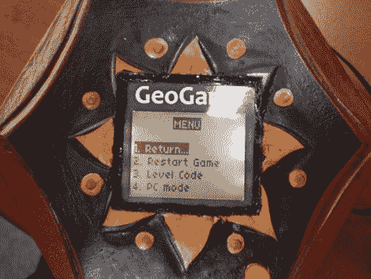

# 反向地理缓存具有用户界面，可重新编程

> 原文：<https://hackaday.com/2011/01/09/reverse-geocache-features-ui-and-is-reprogrammable/>

Here is yet another offering in the Reverse Geocache puzzle arena. We’ve been getting a lot of tips about these projects but [this one in particular stuck out from the others](http://www.elektronika.ba/789/reverse-geocaching-geogame-v1/). [Mure] packed in a bunch of features, starting with the LCD screen seen above. You can just make out the single red button near the bottom of the image which is used to traverse the menu. The octagonal box has an octagonal PCB inside that includes a USB connector. As you can see in the video after the break, this can be used for charging the batteries, and communicating with the internals. An accompanying program is used to generate puzzle data, which can then be programmed via that USB connection to set a new puzzle location. This functionality certainly protects against accidental lock-outs which were a problem with [the last puzzle we looked in on](http://hackaday.com/2011/01/02/reverse-geocaching-christmas-gift-box/).[https://www.youtube.com/embed/Bt4NVdbd2Ek?version=3&rel=1&showsearch=0&showinfo=1&iv_load_policy=1&fs=1&hl=en-US&autohide=2&wmode=transparent](https://www.youtube.com/embed/Bt4NVdbd2Ek?version=3&rel=1&showsearch=0&showinfo=1&iv_load_policy=1&fs=1&hl=en-US&autohide=2&wmode=transparent)