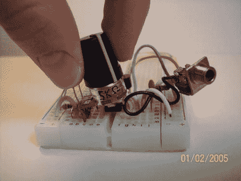

# 基于 555 的调幅无线电发射机

> 原文：<https://hackaday.com/2011/01/10/555-based-am-radio-transmitter/>

拿出那个 555 定时器，用它来[建造你自己的调幅无线电发射机](http://www.instructables.com/id/Easy-AM-Transmitter)。[Rtty21]使用的电路只需要定时器芯片、一个 NPN 晶体管、三个电容、三个电阻和一个电位计。它产生 600 千赫左右的调幅信号，你可以用任何普通的调幅收音机接收到。从这篇文章的评论来看，你似乎可以获得 30-40 英尺的范围。我们不认为这是[FM 间谍麦克风](http://hackaday.com/2010/10/22/fm-bug-using-salvaged-smd-parts/)的竞争对手，但也许你可以把它用作 diy 婴儿监听。