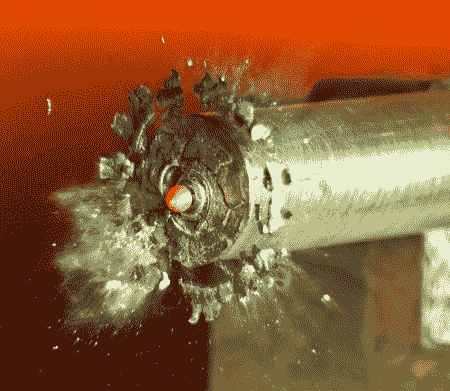

# DIY 空气间隙闪光灯节省至少 7000 美元

> 原文：<https://hackaday.com/2011/01/10/diy-air-gap-flash-saves-at-least-seven-grand/>

你知道吗，标准的相机闪光灯太慢了，拍不出高质量的子弹图像。相对较长的闪光持续时间会导致子弹图像模糊。通过建立这种空气间隙闪光，子弹可以被冻结在半空中，产生一些令人震惊的结果。这里有危险的因素，但不是来自子弹。这种闪光灯使用 35，000 伏的电容器来产生迷你闪电，作为光源。这种装置的造价只有几百美元，如果商业型号的起价真的是 8k 美元，而且还会更高的话，这听起来是一笔大买卖。

现在摄影师有了超快闪光灯，[相机轴](http://hackaday.com/2010/04/05/photographing-splashing-droplets/)负责计时…这就是一切。