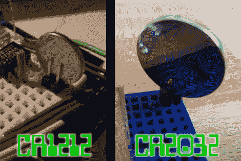
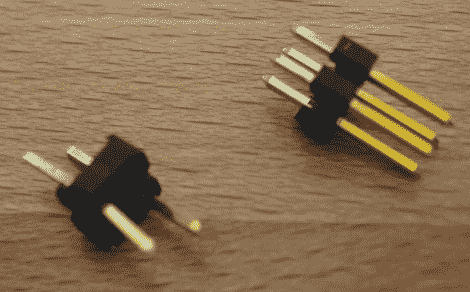
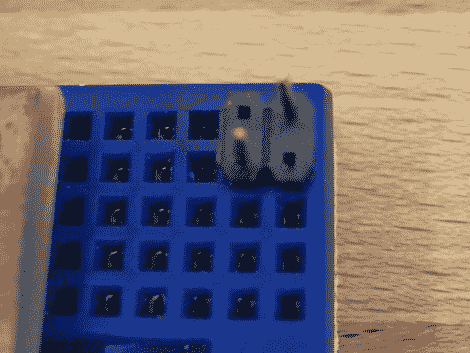

# 用于试验板的纽扣电池连接器

> 原文：<https://hackaday.com/2011/01/11/button-cell-connectors-for-breadboarding/>

我们正在做一个有备用电池的项目，但是我们手头没有更多的硬币电池盒了。没问题，我们记得看到一个双引脚标题用于这一点。但是，当我们试图将 CR2032 电池塞进针之间时，这是行不通的。我们可以发誓我们已经推荐了一个做这个的项目，但是在 [Hackaday](http://hackaday.com) 这里找不到它。经过大量的搜索，我们想出了左边看到的[游击队电池座](http://www.instructables.com/id/Guerrilla-battery-holder-for-your-breadboard-Ard/)。难怪它不工作，图片中的 CR1212 是一个小得多的封装。所以我们想我们必须想出一些别的东西，直到灵感来了。

必须有一些其他的方法来配置引脚接头，以便与较胖的单元体一起工作。在右边，你可以看到对角线方向像一个魔咒。休息之后，请加入我们，观看该连接器的几个特写镜头，以及我们对将其用于各种不同电池的想法。

为了制作这种连接器，从 2×2 引脚接头上移除了两个引脚，为 CR2032 电池留出了空间，以便很好地安装在一个角度上。我们还将剩余的两个引脚放在塑料主体的中心，以形成足够的尾部，从而可以很好地安装在试验板中。既然我们已经做到了这一点，它应该很容易使任何硬币电池工作。稍胖一点的封装可能适用于从 2×3 接头上移除中心两个引脚的情况，或者适用于 2×3 接头上只有两个对角引脚的情况。用你选择的电池试试吧。它可能只是让你通过原型制作阶段，直到下一个零件订单的时候。