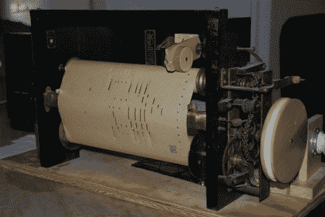

# 数字化播放器钢琴卷

> 原文：<https://hackaday.com/2011/01/11/digitizing-player-piano-rolls/>

有 100 个弹钢琴卷纸却没有弹钢琴的怎么办？你想出了一个方法来[数字化 MIDI 回放的信息](http://quelab.net/wordpress/?p=172)。纸卷上有 90 列孔，88 列用于按键，另外两列用于踏板。纸中的空白导致音符或踏板被弹奏，因此可以使用光学传感器将模拟数据转换为数字信息。很简单，你只需要 90 个传感器。但是这带来了相当大的对齐问题。解决方法是使用光缆将红外光源定位在一个手工制作的 0.2″间距的夹具中。至少间距与标准的 0.1”原型板很好地吻合，这是用来安装传感器的。

[谢谢迈克]